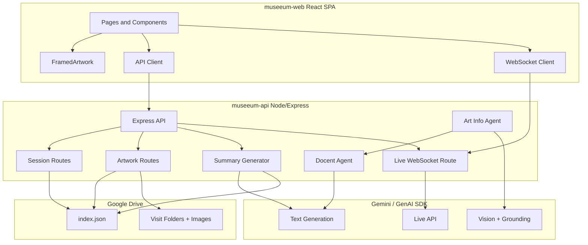

# MuSeeum — Architecture

High-level system design for the MuSeeum AI museum companion (Live Agent + tour story).

> **Structuring a new agent app?** See **[Agent App Architecture Guide (based on Way Back Home)](docs/agent-app-architecture-guide.md)** for directory layout, communication rules, and deployment patterns.

## MVP vs full product

The **MVP** is camera + Live Agent only: session creation, WebSocket to Gemini Live, push-to-talk, and “Describe this” with one image. No Drive, no two-phase artwork flow, no diary. See [docs/mvp-scope.md](docs/mvp-scope.md).

## Overview

MuSeeum (full product) is a two-phase artwork flow: **(1) Art Info Agent** (Gemini + grounding) identifies artist, museum, date; **(2) Docent Agent** generates a visitor-friendly description after user confirmation or 5s timeout. During the visit, a **Live Agent** (camera + voice over WebSocket) answers questions. After the visit, Gemini generates a **personalized tour story** and the user can download a diary (HTML/PDF).

## Diagram

## Components

| Layer | Technology | Responsibility |
|-------|------------|----------------|
| **Frontend** | React, TypeScript, Vite, Tailwind | Login, VisitHome, Live Identification, Artwork Analysis, Gallery, Photo Viewer, Visit Summary, diary export (HTML/PDF) |
| **Backend** | Node.js, Express, TypeScript | REST API (sessions, artwork, summary), WebSocket `/api/live` for Live Q&A |
| **AI** | Gemini (GenAI SDK), Live API | Art Info (vision + grounding), Docent (text), Story generation, bidirectional voice (Live) |
| **Storage** | Google Drive | `index.json` (sessions, artworks, summaries), per-visit folders for images |
| **Auth** | Google OAuth (Drive scope) | Access token validation; guest mode with sessionStorage |

## Data flow

1. **Session** — User starts a visit (or captures first photo without museum); backend creates session in Drive `index.json` and a visit folder.
2. **Artwork capture** — Frontend sends image to `POST /api/session/:id/artwork`. Art Info Agent (Gemini + grounding) returns a **candidate** (title, artist, museum, period, year). User confirms (or 5s auto-confirm); frontend calls `POST /api/session/:id/artwork/confirm`. Docent Agent generates description; backend saves artwork and images to Drive.
3. **Live Q&A** — Client opens WebSocket to `/api/live?sessionId=...&token=...`. Backend connects to **Gemini Live API**, injects current artwork context, forwards client audio to Gemini, streams back transcript and audio.
4. **Summary** — User ends visit; frontend calls `POST /api/session/:id/summary`. Backend marks session completed, calls Gemini to generate story, stores in `index.json`. Visit Summary page shows intro/sections/closing and offers **Download as HTML** / **Download as PDF** (with at least one image per artwork).

## Repositories

- **Backend:** `museeum-api` — Node/TS API, Cloud Run, Google Drive, Gemini (text + Live).
- **Frontend:** `museeum-web` — React/TS SPA, deployable to Vercel or any static host.
