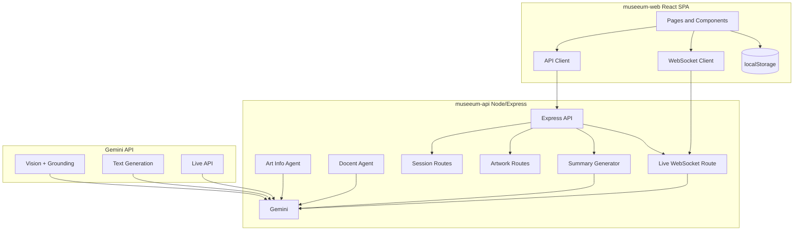

# MuSeeum — Architecture

High-level system design for the MuSeeum AI museum companion (Live Agent + tour story).

> **Structuring a new agent app?** See **[Agent App Architecture Guide (based on Way Back Home)](docs/agent-app-architecture-guide.md)** for directory layout, communication rules, and deployment patterns.

## Hackathon vs full product

For this **hackathon**, the app uses **access code only** (no login) and **localStorage in the webapp** for all visit data (sessions, artworks, photos, summaries). The backend is **stateless** for persistence: it only returns AI results (Art Info candidate, Docent explanation, summary); the frontend persists everything. The full product (see PRD) may use Google Drive and optional Google Sign-In.

## Overview

MuSeeum is a two-phase artwork flow: **(1) Art Info Agent** (Gemini + Google Search grounding) identifies artist, museum, date from an image; **(2) Docent Agent** generates a visitor-friendly description after user confirmation or 5s timeout. During the visit, a **Live Agent** (voice over WebSocket) answers questions. After the visit, Gemini generates a **personalized tour story** and the user can download a diary (HTML/PDF).

## Diagram

## Components

| Layer | Technology | Responsibility |
|-------|------------|----------------|
| **Frontend** | React, TypeScript, Vite, Tailwind, React Router | Access code gate, VisitHome, Photo Menu, Capture, Live Identification, Artwork Analysis, Museum Gallery Grid, Visit Summary, Favorites, Collection Stats, Live Q&A page. **localStorage** for sessions, artworks (with base64 photos), summaries. |
| **Backend** | Node.js, Express, TypeScript | REST: session create, artwork (Art Info), artwork/confirm (Docent), summary. WebSocket **/api/live/:sessionId** for Live Q&A. Stateless for visit data. |
| **AI** | Gemini API (REST + Live) | Art Info (vision + Google Search grounding), Docent (text), Summary (text), Live (bidirectional voice). |
| **Auth** | Access code | Optional `JUDGE_ACCESS_CODE`; sent in body or header. No login or Google OAuth. |

## Data flow

1. **Session** — User captures first photo (or starts from home). Frontend calls `POST /api/session` (with access code if required); backend returns `sessionId`. Frontend stores session in **localStorage** and uses `sessionId` for Live WebSocket and artwork APIs.
2. **Artwork capture** — Frontend sends image to `POST /api/session/:id/artwork`. Art Info Agent (Gemini + grounding) returns a **candidate**. User confirms (voice, type, or 5s); frontend calls `POST /api/session/:id/artwork/confirm`. Docent Agent returns description; frontend updates artwork in **localStorage** (with base64 photo).
3. **Live Q&A** — Client opens WebSocket to `/api/live/:sessionId?accessCode=...&appId=...`. Backend connects to **Gemini Live API**, forwards client audio, streams back transcript and audio.
4. **Summary** — User ends visit; frontend calls `POST /api/session/:id/summary` with artworks from localStorage. Backend returns story; frontend stores summary in **localStorage** and marks session completed. Visit Summary page offers **Download as HTML** (and optionally PDF) from localStorage data.

## Repositories

- **Backend:** `museeum-api` — Node/TS API, Cloud Run, Gemini (text + Live).
- **Frontend:** `museeum-web` — React/TS SPA, localStorage for hackathon; deployable to Vercel or static host.
