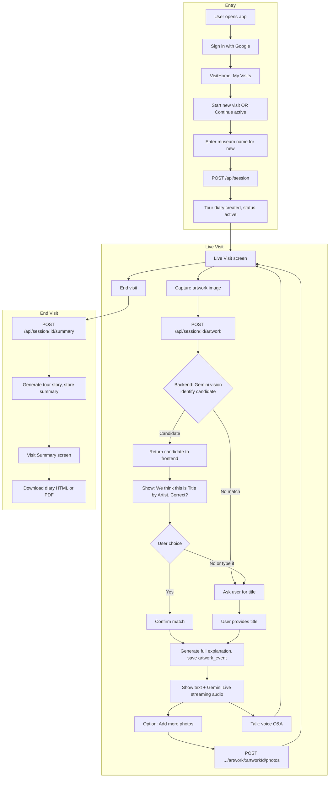

# MuSeeum – Museum visit & tour diary flow

High-level user flow from sign-in through live visit (capture, confirm, explain, voice Q&A) to end-of-visit story and downloadable diary. Aligns with [prd.md](../prd.md) (§5 User flows).

---

## 1. Main flow (detailed)

**Resumable sessions:** From VisitHome (My Visits), user can **Continue** an active session → navigate to Live Visit with that `sessionId` and keep capturing / using Talk until they End visit.

**Live Q&A:** On Live Visit, user holds **Talk** → mic streams to `WS /api/live/:sessionId`; backend sends **mandatory** latest artwork context to Gemini Live; user hears streaming reply; release Talk = barge-in / next question.

---

## 2. Simplified linear flow (for slides / video)

```mermaid
flowchart LR
    A[Sign in] --> B[My Visits]
    B --> C[Start visit + museum name]
    C --> D[Live Visit]
    D --> E[Capture image]
    E --> F[Confirm: Is this the right art?]
    F --> G[Yes or type name]
    G --> H[Explain: style, history, artist]
    H --> I[Text + Gemini Live audio]
    I --> J[Add more photos or Talk]
    J --> E
    J --> K[End visit]
    K --> L[Tour story]
    L --> M[Download diary HTML or PDF]
```

---

## 3. Key decision points

| Step | If … | Then … |
|------|------|--------|
| After capture | Backend returns a candidate (Gemini vision) | Show confirmation; on **Yes** → full explanation, save image(s), show text + Gemini Live audio. |
| After capture | No confident identification | Ask user to enter artwork name/title; backend uses Gemini with that text (and optional ref image) → explanation + save. |
| After confirm | User says **No** or **I'll type it** | User inputs title; same path: explanation + save. |
| Same artwork | User wants another angle | **Add more photos** → `POST .../artwork/:artworkId/photos`. |
| Live Visit | User has a question | Hold **Talk** → voice over WebSocket; backend injects latest artwork context into Gemini Live; streaming reply; release = interrupt. |
| Visit Summary | User wants to keep the story | **Download as HTML** or **Download as PDF** (diary includes session, story, per-artwork content and at least one image per artwork when available). |

---

## 4. Flow ↔ PRD reference

| Flow element | PRD section |
|--------------|-------------|
| Sign in, VisitHome, Start / Continue visit | §5.1 Sign in & start visit |
| Capture → candidate → confirm → explanation, Add more photos | §5.2 Capture artwork → confirm → explanation |
| Talk (voice Q&A), mandatory artwork context | §5.3 Live Q&A (Gemini Live Agent) |
| End visit → summary → Visit Summary | §5.4 End visit & generate story |
| Download diary (HTML / PDF), required artwork images | §5.5 Downloadable diary |
| Resumable active sessions | §5.1, §6 VisitHome |

---

## 5. Grounding and context (implementation reminder)

- **Artwork data:** Gemini vision + user confirmation or user-entered title only. No external artwork DB or museum API; do not fabricate museum metadata.
- **Museum name:** Passed to Gemini as **context** (e.g. “User is at [museumName]”) to improve relevance—not used to call any external API.
- **Live Agent:** Backend must send **mandatory** latest artwork context (when available) into the Gemini Live session; if no artwork yet, session context only (e.g. museum name).
